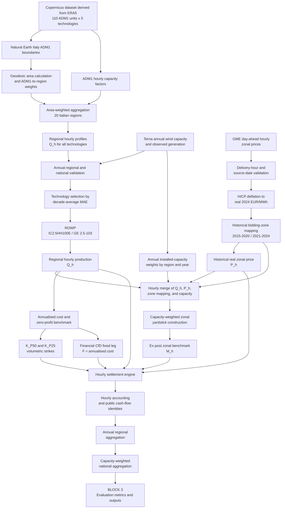

# Empirical Pipeline and Methodological Flowchart

## BLOCK 1: DATA ACQUISITION & PREPROCESSING (Phase 1)
*This block transforms raw data into a homogeneous historical laboratory for contract settlement.*

**A. Wind Resource & Technology Selection**
* **Raw Input:** Copernicus global energy dataset derived from ERA5, `sis-energy-global-reanalysis` (110 ADM1 provincial units, 5 onshore wind technologies).
* **Spatial Aggregation:** Mapped to 20 Italian regions using Natural Earth boundaries (geodesic-area-weighted mean).
* **Validation & Selection:** Screened against Terna annual regional capacity and national generation data.
* **Selected Profile:** Reference Onshore Wind Profile (ROWP), Copernicus `IC2.5HH100E`, corresponding to the GE Energy 2.5--103 onshore turbine (2.5 MW, 100 m hub height, 103 m rotor diameter); national MAE is 129.9 MWh/MW over 2015-2024.
* **Generated Variable:** $Q_{h}$ (Regional hourly production profile per MW).

The normalization procedure first constructs a reproducible spatial crosswalk
between the coded Copernicus ADM1 units and the Italian administrative regions.
Natural Earth polygons are filtered to Italy, their geodesic areas are
calculated on the WGS84 ellipsoid, and each ADM1 unit receives a within-region
area weight. The weights are required to cover exactly 110 Italian units and 20
regions, with weights summing to one within every region. For each timestamp and
technology, the coded capacity factors are then aggregated as an area-weighted
mean and stored in long form with the fields `timestamp_utc`, `region`,
`technology`, and `capacity_factor`.

The historical loader enforces complete Europe/Rome delivery-hour coverage for
each region, year, and technology, canonicalizes regional names, rejects
missing, duplicated, non-finite, or out-of-range capacity factors, and compares
the five available onshore technologies over the entire 2015-2024 period. For
technology selection, hourly capacity factors are summed into annual MWh/MW
profiles, multiplied by Terna regional installed wind capacity, and aggregated
nationally. The selected technology is the one with the lowest decade-average
Mean Absolute Error against Terna national annual generation per MW; Terna is
therefore used for validation and technology selection, not as an hourly
replacement for Copernicus.

**B. Market Prices & Bidding Zones**
* **Raw Input:** GME Day-Ahead Market hourly zonal prices (2015-2024).
* **Inflation Adjustment:** Converted to real 2024 EUR using the Italian annual HICP from Eurostat.
* **Historical Network Mapping:** Dynamic bidding zone assignment matching Terna's topology (e.g., Umbria and Calabria shifting zones from January 1, 2021).
* **Generated Variable:** $P_{h}$ (Historical real zonal hourly price).

For each year, the loader reads the corresponding GME workbook, reconstructs
the Europe/Rome delivery-hour calendar in UTC, and verifies that the source
dates match the calendar sequence, including daylight-saving-time transitions.
Prices are retained in nominal terms for auditability and converted to real
2024 EUR/MWh using the Italian annual HICP ratio
$HICP_{2024}/HICP_{year}$. The historical mapping is applied at the year level:
before 2021, Umbria belongs to Centro Nord and Calabria to Sud; from 2021,
Umbria belongs to Centro Sud and Calabria is represented as a separate zone.
This prevents the post-2021 topology from being imposed retrospectively on the
earlier observations.

**C. Zonal Benchmark Construction**
* **Merging A & B:** Intersecting regional production ($Q_h$) with historical zonal mapping for each specific hour.
* **Capacity Weighting:** Calculating the capacity-weighted mean production of all regions within a given bidding zone.
* **Generated Variable:** $M_{h}$ (Ex-post capacity-weighted zonal yardstick benchmark).

The resulting panel joins the selected regional wind profile to the bidding
zone that is valid for the observation's delivery year. For each zone-hour, the
benchmark is computed from the installed-capacity-weighted regional profiles:

$$
M_h = \frac{\sum_{r \in z(h)} C_{r,y(h)} Q_{r,h}}
           {\sum_{r \in z(h)} C_{r,y(h)}} ,
$$

where $C_{r,y(h)}$ is Terna gross installed wind capacity for region $r$ in the
relevant year, $Q_{r,h}$ is the regional Copernicus profile, and $z(h)$ is the
historically valid bidding zone. The benchmark is an ex-post, one-MW zonal
yardstick and is intentionally distinct from the individual asset's output.
The outputs of Block 1 are therefore a homogeneous hourly production input, a
real hourly zonal price input, a historical region-to-zone key, and the zonal
benchmark required by the settlement layer.

## BLOCK 2: STRIKE CALIBRATION & CfD SETTLEMENT (Phase 2)
*This block converts the homogeneous hourly inputs from Block 1 into comparable contract cash flows for a stylised 1 MW regional proxy asset.*

**A. Annualised Cost Benchmark and Zero-Profit Rule**
* **Cost Input:** Annualised plant cost of approximately 178.4 kEUR/MW-year in real 2024 EUR, based on CAPEX, OPEX, WACC, and lifetime assumptions documented from the ARERA cost benchmark.
* **Economic Rule:** The Financial CfD fixed leg is calibrated to the long-run zero-profit condition, so the annual fixed payment covers the stylised annualised cost before realised regional basis risk.
* **Fixed Payment:** $F = 178{,}395.1047$ EUR/MW-year; the same value is used under both strike scenarios.

The cost benchmark is applied to a stylised one-megawatt asset and is not an
auction outcome or a project-specific financial forecast. The fixed annual
payment is distributed across the delivery hours of each calendar year only to
construct an hourly accounting panel:

$$
F_h = \frac{F}{H_y}, \qquad h \in y,
$$

where $H_y$ is the number of observed delivery hours in year $y$. The fixed leg
is therefore not calculated as a product of a volumetric strike and a selected
full-load-hour percentile.

**B. Volumetric Strike Calibration**
* **Production Statistic:** Construct the ten national annual full-load-hour observations from the selected Copernicus technology, using Terna installed capacity as the annual aggregation weight.
* **$K_{P50}$ Scenario:** Divide annualised cost by the median national full-load hours; the validated strike is approximately 91.64 real 2024 EUR/MWh.
* **$K_{P25}$ Scenario:** Divide annualised cost by the lower-quartile national full-load hours; the validated strike is approximately 98.68 real 2024 EUR/MWh.
* **Interpretation:** $K_{P25}$ is the conservative calibration stress test because fewer expected MWh must recover the same annualised cost; its regional maps are reported in the appendix.

For either volumetric scenario, the strike is uniform across regions and years:

$$
K_s = \frac{C_{annual}}{FLH_s}, \qquad
s \in \{P50, P25\},
$$

where $C_{annual}$ is the annualised cost per MW-year and $FLH_s$ is the
corresponding national full-load-hour statistic. The Financial CfD uses the
same fixed payment $F$ in both rows; the labels $K_{P50}$ and $K_{P25}$ do not
scale its lump-sum leg.

**C. Hourly Contract Settlement**
* **Market Only:** No contractual settlement; producer revenue is $R_h^{M} = P_h Q_h$.
* **Conventional Two-Sided CfD:** Settle on the asset's own output, $S_h^{C} = (K_s-P_h)Q_h$, so total producer revenue is $R_h^{C} = K_s Q_h$.
* **Zonal Yardstick CfD:** Settle on the ex-post zonal benchmark, $S_h^{Y} = (K_s-P_h)M_h$, so total producer revenue is $R_h^{Y} = P_hQ_h + (K_s-P_h)M_h$.
* **Financial CfD:** Pay the fixed annual amount and claw back the benchmark market value, $S_h^{F} = F_h - \max(P_h,0)M_h$, so total producer revenue is $R_h^{F} = P_hQ_h + S_h^{F}$.

For the conventional and Zonal Yardstick CfDs, positive settlement values are
recorded as public top-up and negative settlement values as public clawback:

$$
TopUp_h = \max(S_h,0), \qquad
Clawback_h = \max(-S_h,0), \qquad
NetPublicCost_h = TopUp_h - Clawback_h.
$$

For the Financial CfD, the fixed payment is recorded as gross top-up and the
non-negative benchmark market value as gross clawback. This preserves the
distinction between large gross transfers and the resulting net public
position. The use of $\max(P_h,0)$ follows the implemented restitution rule;
the 2015-2024 GME sample contains no negative-price observations, so this
feature is not empirically stress-tested in the historical baseline.

**D. Settlement Panel and Aggregation**
* **Hourly Layer:** Apply each mechanism to every region-hour and to both strike scenarios, retaining market revenue, contractual settlement, producer revenue, top-up, clawback, and net public cost.
* **Annual Regional Layer:** Sum hourly quantities and cash-flow components by region, year, mechanism, and strike label.
* **National Layer:** Scale regional per-MW flows by Terna installed capacity and aggregate to the capacity-weighted national portfolio.
* **Accounting Checks:** Verify producer revenue equals market revenue plus settlement and that top-up minus clawback equals net public cost at hourly and annual levels.

The zonal yardstick creates the accounting identity

$$
R_h^{Y} = K_s M_h + P_h(Q_h-M_h),
$$

which makes the remaining regional exposure explicit: $Q_h-M_h$ is spatial
basis risk. At capacity-weighted zonal or national aggregation, deviations
from the benchmark cancel by construction. This is an aggregation identity and
does not imply that the conventional and yardstick contracts are equivalent
for an individual regional proxy asset.

## BLOCK 3: EVALUATION METRICS & OUTPUTS (Completed Phase 2)
Producer risk is measured as the sample standard deviation of ten annual regional
revenues. Public flows are reported as gross top-up, gross clawback, and net
public cost. The main manuscript reports the three `K_P50` maps; the appendix
reports the corresponding three `K_P25` calibration stress-test maps.

---

## BLOCK FLOWCHART

